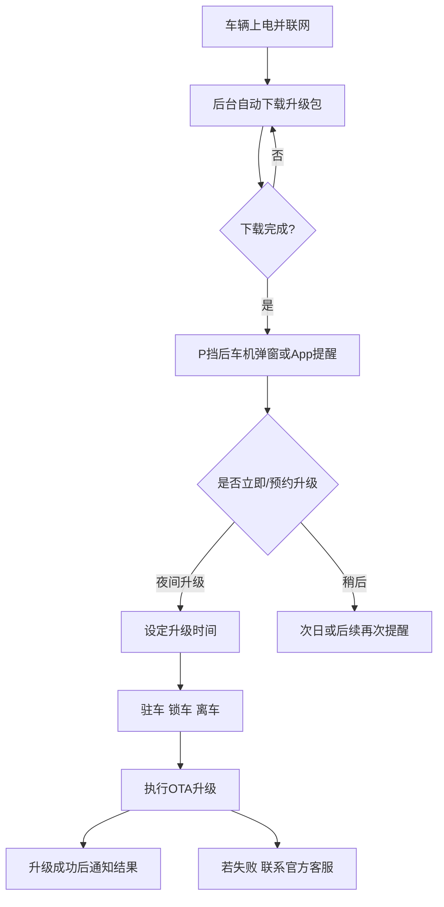
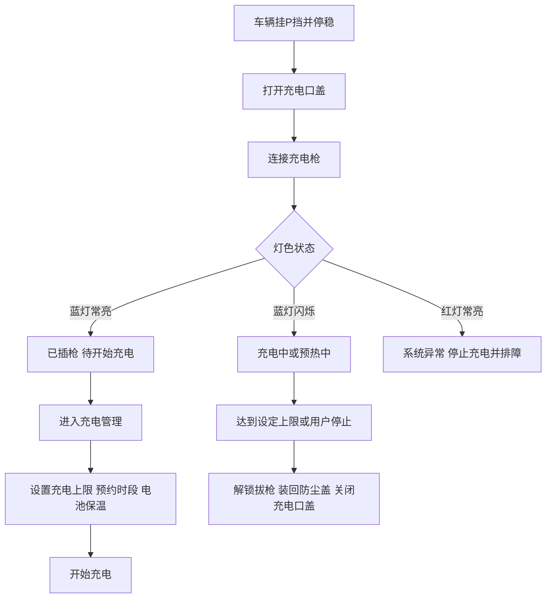
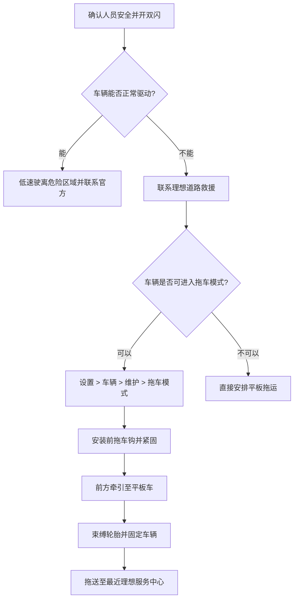

# 理想L9用户手册草稿

## 摘要

全新一代理想 L9 是理想汽车当前面向具身智能时代打造的旗舰增程 SUV。官方已明确：车辆采用理想第三代自研增程系统与 **72.7kWh 5C 超充电池**，**CLTC 纯电续航 420km**、**CLTC 综合续航 1650km**、**WLTC 百公里油耗 6.3L**；座舱核心卖点包括 **29 英寸 6K 一体式前排超宽屏**、**21 英寸 4K 后舱神奇移动屏**、**5440W 9.3.6 布局音响系统**、四零重力座椅、10L 智能冰箱和七温区体感控温。底盘方面，官方重点强调 **800V 主动悬架** 与“**完全体**”线控底盘；Livis 版本相较 Ultra 又进一步升级了主动悬架、EMB 线控制动和双马赫智能辅助驾驶。citeturn13view0turn24search0turn22search0

从车主实际使用角度，L9 的核心体验可以概括为三件事：**一是把“启停、换挡、调节座椅、灯光、空调、语音、投屏、车控”尽量集中在中控屏与控制中心完成；二是把补能从“找桩”扩展到“预约充电、低价时段、补能规划、电池保温、即插即充”等完整流程管理；三是把售后从“故障后到店”扩展到“车机保养提示、远程诊断、7×24 小时救援、平板拖运”**。这些能力在官方帮助中心、在线手册和 OTA 说明中均有明确体现。citeturn42search0turn42search1turn51view1turn49search6turn17view1turn15search7

如果只抓最重要的用车要点，建议优先记住以下规则：**儿童座椅不要装在前排副驾；胸部与方向盘距离尽量保持不少于 250mm；车辆连接充电枪时不能启动车辆；长期停放前动力电池建议保持 50%–80%，每 3 个月至少维护一次并充至 80%；拖车模式仅适合低速短距离挪移，优先平板拖运；遇到动力电池高温、高压相关故障、冒烟漏液等情况，应先拉开距离并联系官方救援**

## 目录

- [一、车辆概述](#overview)
- [二、安全信息](#safety)
- [三、仪表与控制](#controls)
- [四、中控与信息娱乐系统](#infotainment)
- [五、驱动与驾驶模式](#drive)
- [六、充电与电池维护](#charging)
- [七、保养与定期检查](#maintenance)
- [八、故障排查与常见问题](#troubleshooting)
- [九、紧急救援与拖车指南](#rescue)
- [十、附录](#appendix)

## 车辆概述与安全信息

### 车辆概述

官方发布信息显示，全新一代理想 L9 当前在售为两款：**L9 Ultra** 和 **L9 Livis**。其中 Ultra 官方统一零售价 **45.98 万元**，Livis 官方统一零售价 **50.98 万元**。两车均属于六座旗舰 SUV，均搭载第三代增程系统与 72.7kWh 5C 电池；而 Livis 明确增加了 800V 主动悬架、EMB 线控机械制动、双马赫智能辅助驾驶，以及一套专属设计套件。citeturn13view0

下表只列出**当前官方资料明确公开**的版本差异和共性功能；凡当前发布稿未明示的项目，本文不作推断。citeturn13view0

| 项目 | L9 Ultra | L9 Livis |
|---|---|---|
| 官方售价 | 45.98 万元 | 50.98 万元 |
| 交付时间 | 2026-05-17 起 | 2026-05-17 起 |
| 增程系统 | 第三代自研增程器 | 第三代自研增程器 |
| 电池 | 72.7kWh 5C 超充电池 | 72.7kWh 5C 超充电池 |
| 纯电续航 | 420km CLTC | 420km CLTC |
| 综合续航 | 1650km CLTC | 1650km CLTC |
| 底盘重点 | 线控转向、后轮转向、EHB、第三代双腔双阀魔毯空气悬架 | 在 Ultra 基础上升级 800V 主动悬架、EMB、双马赫智能辅助驾驶 |
| 专属外观/配置 | 官方未单列专属套件 | 晶灰 22 英寸轮毂、三色星环灯、双色方向盘、迎宾光毯等 |
| 可选配置 | 官方发布稿列出部分选装项 | 官方发布稿列出部分选装项 |

全新一代理想 L9 在当前官方公开资料中明确的关键参数如下：**车长 5255mm、车宽 2000mm、车高 1810mm、轴距 3125mm、纯电续航 420km、综合续航 1650km、WLTC 油耗 6.3L/100km、峰值充电功率 420kW、官方称“10 分钟就能充到 80%”**。另外，发布稿还明确写到：四零重力座椅、29 英寸 6K 前排屏、21 英寸 4K 后舱移动屏、5440W 音响、10L 冰箱、后轮转向带来的 **5.3m** 极小转弯半径。citeturn13view0turn22search0turn24search0

对车主最常关心、但当前官方公开资料**没有明确值**的项目，本稿统一按以下方式处理：**百公里加速时间、整车最大功率、峰值扭矩、轮胎规格、油箱容积、整备质量、直流/交流从 0–100% 的统一标定时间**，当前公开官方车型页、发布稿和帮助中心检索结果中均**未见一套完整、逐项明确的公开表格**，因此本文在附录参数表中标注为“未公开”或“未在官方资料中找到”。citeturn13view0turn24search0turn23search1

> 图片资源索引：全新一代理想 L9 的官方外观图、座舱图、底盘/悬架示意图可在理想汽车发布稿配图中查看。citeturn13view0

### 安全信息

#### 乘员安全

理想官方在线手册明确建议，驾驶前至少完成五项检查：**确认车灯工作正常、车周无障碍物、所有车窗清晰且后视镜视野良好、续航与中控警示信息正常、制动/加速踏板区域无杂物干扰**。同时，正确坐姿直接影响安全带和气囊的保护效果；官方建议**胸部与方向盘距离不少于 250mm**，身体尽量贴合靠背，头枕位置到位，并让肩带位于颈部与肩部之间、腰带尽量低地横跨髋部。citeturn46search7

理想官方手册还给出了安全带提醒逻辑：所有座位均带乘员检测，车辆启动后若有人未系安全带，中控会点亮警告灯；当驾驶员或前两排乘员未系安全带，且车辆行驶一段时间或车速超过 **15km/h** 后，会触发更高等级的蜂鸣与闪烁告警。若系好后仍持续报警，应视为装置异常并联系官方。citeturn45search7turn52view0

#### 儿童安全与儿童座椅

官方对儿童乘坐有几条底线要求：**儿童优先坐后排；应根据体形使用儿童安全座椅；儿童不得单独留在车内；应避免儿童误操作车窗、遮阳帘、前舱盖、后备厢门和座椅等可能夹伤身体的部件**。同时，官方明确强调：**严禁在前排副驾安装儿童安全座椅**，尤其不得在受前排安全气囊保护的位置安装后向儿童座椅。citeturn46search2

就安装适配性而言，理想官方 L 系列共享手册公开表格显示：**前排乘员座椅不适用于常规儿童安全座椅；第二排和第三排可适配通用类儿童座椅**。对于 ISOFIX，手册公开页显示：**后向 ISOFIX 儿童座椅仅可安装于第二排**；体重不超过 18kg 的儿童，优先按照座椅说明书与车型适配表安装。与此同时，中国现行强制性国家标准 **GB 27887-2024《机动车儿童乘员用约束系统》**已于 **2025-07-01** 实施，因此建议优先选购符合现行标准、并与车辆适配的约束系统。citeturn41search6turn45search9turn20search1

理想的儿童锁并不是单一“后门童锁”概念，而是一个可在中控中按位置管理的功能组。官方说明显示，车主可在 **设置 > 车辆 > 儿童锁** 中分别锁定后排门窗以及第二排、第三排座椅功能；被锁定后，对应后车门无法从车内开启，后排车窗开关失效，相关座椅的调节、按摩、加热和通风也不能通过物理按键或语音触发。citeturn46search3

#### 安全气囊与被动安全

公开可检索的理想 L 系列共享手册示例页显示，同平台六座车型采用 **8 气囊布局**：**前排气囊 2 个、侧气囊 4 个、侧气帘 2 个**。其中侧气帘保护外侧乘员头部，前排主/副气囊保护头胸部，侧气囊保护驾驶员、前排乘员以及第二排外侧乘员躯干；远端侧气囊还会兼顾主副驾间的肩部与头部防护。需要注意：**当前公开的最新 L9 目录虽然明确存在“安全气囊”章节，但未在车型页单独列出气囊数量**，所以这里将其作为**理想 L 系列官方共享手册的可检索参考**，实际配置仍应以车机内 L9 手册为准。citeturn25search0turn46search0

如果安全气囊系统故障，对应警告灯会在车辆启动后不按正常逻辑熄灭。官方警示信息中明确写到：若**安全气囊系统故障灯**常亮，说明可能是气囊本体、控制器或安全带预紧器出现异常，应尽快联系理想客服；发生碰撞时，EDR 事件数据记录系统还会按 **GB 39732** 要求记录关键运行和约束系统信息，包括车速、安全带状态、加速/制动踏板、ABS、AEB、ESP 等，以便事故还原。citeturn52view0turn46search4

#### 高压系统与紧急操作

理想官方对高压安全的提示非常直接：**高压部件有明确警示标识，高压线束均为橙色；不要触摸、拉拽、损坏高压线束和插头，不要接触动力电池泄漏液体**。如果车辆发生严重碰撞，系统会自动切断高压供电，以降低事故风险。若发生故障或极端环境导致高压系统无法正常工作，车辆还会进入“电源管理”状态，只保留部分关键功能，比如危险警告灯、阅读灯和紧急呼叫，并限制空调、座椅加热/通风、屏幕、无线充电等舒适性功能。citeturn51view0turn46search5

在救援场景中，官方给出了手动高压切断方法：**前舱打开后，拆下雨刮盖板，可剪断或拉断紧急高压切断线束；随后还应断开蓄电池负极线束并做好绝缘防护**。官方同时强调，**不要在非紧急情况下手动切断高压系统**。如果车辆发生起火：火势小且不涉及高压系统时，可尝试灭火器初期处置；若火势较大或位于动力电池附近，应立即远离车辆并报警。citeturn46search8turn51view0

## 仪表控制与车辆互联

### 仪表与控制

L9 的公开手册目录显示，驾驶相关的人机界面由**安全驾驶交互屏、抬头显示、中央中控屏、控制中心以及方向盘/拨杆/快捷控制**共同组成；而公开可检索的 L 系列手册页进一步说明，中控顶部状态栏、环境感知区域、媒体卡片和底部功能栏构成了车主最常用的主界面。P 挡下，环境感知区域还能直接弹出油箱盖、后备厢门、充电口盖等快捷操作。citeturn25search0turn42search0turn49search7

方向盘和高频按键是日常最常用的实体控制。公开可检索的 L 系列官方手册页显示：方向盘支持上下前后调节；左侧按键/拨杆主要承担**语音唤醒、接打电话、媒体播放与切歌**，右侧按键/拨杆主要承担**智能驾驶自定义键、巡航速度设定与变道确认/取消**。如果车机出现死机，官方还提供了软重启方案：**同时向下长按最左侧拨杆和最右侧拨杆约 10 秒，可重启中控屏和副驾娱乐屏**。citeturn43search4turn44search5

电源逻辑方面，官方说明为：**解锁后进入 ACC；踩下制动踏板并携带智能钥匙或蓝牙钥匙时进入 READY；锁车离车后整车下电**。还需特别记住两条：**连接充电枪时无法启动车辆；若车辆启动状态下驾驶员侧车门打开且驾驶员离座，车辆会从启动模式切回 ACC**。citeturn41search2turn49search5

换挡机构为电子换挡杆，公开可检索的官方手册页写明：车辆提供 **P / R / N / D** 四个挡位；通常需要在**踩下制动**且符合车速条件时才能切挡。P 挡可以通过换挡杆末端按钮切入；低速下打开驾驶员车门、关闭电源、连接充/放电枪、手动激活电子驻车等条件，也可能触发车辆自动切入 P 挡。若制动功能异常，官方允许在紧急情况下**长按 P 挡按钮**触发动态驻车制动用于停车，但仅限紧急使用。citeturn40search0

门、窗与座椅是 L9 日常家庭用车的高频区域。全新一代理想 L9 的官方发布稿明确写到：**车内外均提供机械门把手和电子门把手**，并且四个电动车门引入了电容防夹条，让电吸门也具备防夹能力。车窗方面，官方共享手册说明：驾驶员门板可开启儿童门窗锁，后排也可通过智能钥匙长按实现整车开闭窗。citeturn13view0turn46search6

前排座椅具备记忆功能。根据官方共享手册：车主在手动调完前排座椅后，屏幕会弹出保存坐姿的提示；也可以在 **设置 > 车辆 > 座椅 > 坐姿选择与编辑** 中保存或调出位置。更重要的是，**驾驶员记忆位会同时保存方向盘与外后视镜位置**；在倒车挡下手动调节后视镜镜面时，镜面位置还会自动写入对应记忆位。迎宾座椅功能开启后，**挂 P 挡开门下车**时，主驾座椅和方向盘会自动让位；关门上车后会自动恢复。citeturn45search0turn45search3

第二排和第三排座椅操作同样相当重要。公开手册页显示，二排支持一键**后移**和**居中**；第三排靠背可电动放倒/抬起，在动作过程中若与第二排有干涉，系统会先调整第二排座椅位置再完成第三排动作。citeturn45search1turn45search2

灯光与雨刮的高频控制建议优先熟悉。官方共享手册显示：外部灯光可在中控底部灯光控制界面直接管理，支持**关闭、位置灯、近光灯、自动模式、后雾灯、星环灯、智能远光灯**。前雨刮共有**高速、低速、自动高灵敏、自动低灵敏、关闭**五挡；后雨刮支持间歇刮刷和喷洗联动。citeturn41search1turn41search0turn50search0

外后视镜通过主驾门板开关调节，支持左右镜面选择、电动折叠和展开。官方明确提示：**请在停车状态下调节后视镜，不要在驾驶中操作**。此外，一些镜面相关功能也能由语音直接触发，例如后视镜加热、折叠/展开、锁车自动折叠和倒车自动下倾。citeturn50search1turn50search2

下表适合打印后贴在车库或家中，作为高频操作速查。以下路径基于官方在线手册公开内容整理；如车机 OTA 后路径不同，以实车为准。citeturn42search0turn42search1turn41search2turn41search1

| 高频功能 | 建议记忆方式 |
|---|---|
| 启动车辆 | 解锁后踩制动，看到 READY |
| 熄火/下电 | 锁车离车自动下电；静止时也可在维护菜单关闭整车电源 |
| 换挡 | 踩制动后拨杆切 D/R/N；P 挡通过末端按钮 |
| 灯光 | 中控底部灯光图标进入 |
| 前雨刮 | 控制杆旋钮五挡 |
| 后雨刮 | 单独按键控制间歇和喷洗 |
| 座椅记忆 | 调整后保存坐姿；记忆位可联动方向盘和后视镜 |
| 迎宾座椅 | 设置 > 车辆 > 座椅 |
| 儿童锁 | 设置 > 车辆 > 儿童锁 |
| 充电口盖 | 中控底栏快捷键 / 车外按压 / 车钥匙 |
| 软重启 | 两侧拨杆同时长按约 10 秒 |

### 中控与信息娱乐系统

从公开的官方共享手册看，L 系列中控主界面由四块信息层组成：**顶部状态栏、中央环境感知区、媒体卡片与底部功能栏**。状态栏里会显示时间、网络、蓝牙、外部温度和部分警示灯；环境感知区承担车辆状态、道路感知、障碍物、P 挡车控快捷图标等信息；底部功能栏则是进入灯光、全景影像、控制中心等功能的最快入口。citeturn42search0

控制中心是车主操作频率第二高的页面。官方说明可通过两种方式进入：**点击底栏控制中心图标**，或**从中控顶部向下滑动**。控制中心中可见驾驶员账号、蓝牙临时开关、蜂窝网络开关、公路/能源模式入口、音量亮度、自定义快捷键、通知中心、坐姿切换等。citeturn42search1

手机互联方面，理想官方给出了三套路径。第一种是**系统蓝牙**：主驾和副驾可单独连接不同设备，主驾常用于手机、平板、电脑、手柄；副驾常用于蓝牙耳机、蓝牙音箱和手柄。第二种是**蓝牙电话**：支持来电语音播报、骚扰电话识别，以及通话最小化不打断其他操作。第三种是**有线/无线投屏**：有线投屏通过官方直连投屏线完成，支持中控屏与副驾娱乐屏；无线投屏则通过车机热点和手机“屏幕镜像/投屏”完成，中控屏为保证行车安全，**仅在 P 挡支持无线投屏**。citeturn44search1turn44search0turn44search2turn44search3

语音助手“理想同学”是 L9 车机的核心入口之一。公开官方手册写明：可通过**说出“理想同学”**或使用**方向盘按键**唤醒；支持**唤醒人锁定、连续对话、自由对话、可见即可说、多人同时下指令、随时打断**，并支持粤语、上海话、四川话、河南话、河北话、山东话、天津话、陕西话、普通话等多种方言交互。其能力已经扩展到**车控、导航、美团地点检索、浏览器搜索、媒体控制、保养提醒、胎压/能耗问答和任务大师一键执行**。citeturn43search0turn43search1turn43search3turn42search5

导航方面，公开技能页虽然没有完全展开“地图应用”的每一项按钮，但已经明确显示：理想同学可在景点/餐饮/沿途 POI 查询后，直接把地点发起导航；车主也可通过语音说“开始导航”“导航去第 X 个结果”等口令完成操作。对长途场景，OTA 8.0 起又新增了“智能油电混动（Beta）”与智能充电推荐，导航会在满足条件时按约两小时一段的节奏推荐服务区补能点。citeturn43search3turn28search0

OTA 是理想车机体验的重要部分。官方在线手册要求：升级前保持车辆驻车、动力电池电量充足、离车并锁车；升级时不要移动车辆；充电中也可升级，但升级过程中会中断充电，升级完成后是否自动恢复充电取决于充电桩。官方社区 OTA 说明则补充：升级包通常在车辆上电且联网时后台下载，下载完成后在 P 挡弹窗提醒，或由 App 推送，用户可选择夜间升级。citeturn42search2turn27search0turn28search1

上图根据理想官方 OTA 手册与注意事项整理；若车辆正在充电，升级过程中充电会中断，结束后是否恢复取决于桩端和车端判断。citeturn42search2turn27search0turn28search1

## 驱动补能与电池

### 驱动与驾驶模式

从当前官方车型页与发布稿可以明确看出，L9 的核心逻辑仍是“**增程电驱为主，充电体验尽量接近纯电**”。理想汽车已明确：全新一代理想 L9 采用**理想第三代自研增程系统**与**72.7kWh 5C 超充电池**，支持 **420km CLTC 纯电续航**、**1650km CLTC 综合续航**，并给出了 **WLTC 6.3L/100km** 的油耗数据。官方同时强调，第三代增程器具备更好的静音与“几乎无感”的启动体验，并引入了**增程器智能保养**。citeturn13view0turn24search0

驾驶启动逻辑很简单：**解锁—踩制动—看到 READY—挂挡出发**。关闭则以**离车锁车自动下电**为主。需要特别注意的是，**只要车辆连接充电枪，就无法启动车辆**。如果车辆当前为启动状态，但打开驾驶员车门且驾驶员离座，系统会回退到 ACC，避免误操作。citeturn41search2turn49search5

公开可检索的理想官方共享手册中，**能量回收**是驾驶模式里最清晰的一项：在 **设置 > 车辆 > 驾驶 > 能量回收** 中，可选择 **舒适、标准、强** 三档。官方同时提醒两种限制情况：**环境过热/过冷时，能量回收可能受限；动力电池电量较高时，能量回收也可能被限制，待电量下降后才恢复。**citeturn40search1

关于不少车主会问到的“**四驱/后驱切换**”，本次检索到的**当前官方 L9 公布资料、公开在线手册目录和帮助中心文本中，未见独立的‘后驱/四驱手动切换’条目**。控制中心里可以看到“公路模式和能源模式”的入口，但公开可检索页面并未完整展开当前最新版 L9 对应的每一种驱动策略名称和逻辑。因此，本稿对此项的结论是：**未在当前官方资料中找到“手动四驱/后驱切换”说明**。若后续通过 OTA 加入新的动力策略，请以车机 **设置 / 实验室 / 驾驶** 页面为准。citeturn42search1turn25search0turn13view0

如果您的车辆已升级到较新的系统版本，还应留意 **OTA 8.0** 开始上线的“**智能油电混动（Beta）**”。官方说明显示，在长途导航总时长大于 2 小时、高速里程大于 100km 的条件下，该功能可进行**智能油电分配**与**智能充电推荐**，帮助车辆在更合适的时机保留电量、优化补能点选择。该功能默认关闭，需要到 **设置 > 通用 > 实验室** 开启。citeturn28search0

下表给出一个适合日常使用的“驾驶策略速览”。其中“后驱/四驱切换”因为当前官方资料未公开，故单独注明。citeturn40search1turn42search1turn28search0

| 场景 | 建议关注项 | 官方公开状态 |
|---|---|---|
| 城市通勤 | 纯电优先使用，关注能量回收等级与预约充电 | 官方支持能量回收三档、预约充电 |
| 高速长途 | 使用导航补能规划，关注智能油电混动与服务区充电推荐 | OTA 8.0 起公开支持 |
| 山路/狭窄路段 | 关注 5.3m 最小转弯半径、全景影像、泊车辅助 | 官方已明确 |
| 驱动形式/手动四驱切换 | 当前公开资料未见独立 2WD/4WD 手动切换页面 | 未在官方资料中找到 |

### 充电与电池维护

理想给 L9 车主提供的补能路径，分为**家用充电桩、理想自营超充/优选超充/合作站公共充电，以及对外放电**。帮助中心公开说明显示，理想官方家充产品常见为**7kW 交流充电桩**与**20kW 直流充电桩**：前者使用 **220V 单相交流**、IP55；后者使用 **380V 三相交流**、IP65。理想还明确表示：其家充桩为**国标接口**，理论上支持符合国标的车辆充电。citeturn17view0turn22search3turn37search2turn37search4

公共网络方面，理想帮助中心 2026 年公开数据写明：目前已有**4000 多座理想超充站、3000 多座优选超充站、50000 多座合作充电站**；理想 App 支持找桩、先充后付、积分抵扣、停车费减免和即插即充等服务。对 L9 本身，官方车型页进一步给出了当前最关键的一项快充信息：**峰值充电功率 420kW，官方宣传“10 分钟就能充到 80%”**。citeturn37search6turn22search0

需要区分的是：**官方当前公开资料明确给出了 5C 超充能力与 10 分钟到 80% 的快充口径，但未公开统一的“家用 7kW 交流桩从 0–100% 需要多少小时”的 L9 专属标定时间**。因此，如果您只接受官方明示数据，可将“家充总时长”记为**未在官方资料中找到**。citeturn22search0turn23search1turn37search2

在车内设置层面，公开手册页显示，**应用列表 > 充电管理** 中可设置：**充电上限（80%–100%）、停止充电、预约充电、开始充电和电池保温**。预约充电支持三类逻辑：**按时开始、低价充电、按时结束**。其中“低价充电”只在指定时段内工作，同时禁用电池保温；电池保温则有最长 **12 小时** 的计时逻辑。citeturn51view1

充电指示灯的颜色也值得记住。官方说明如下：**白灯常亮**表示车辆已就绪、但未连接枪；**蓝灯常亮**表示已插枪但未开始充电或已充满；**蓝灯闪烁**表示正在充电或电池预热；**绿灯常亮/闪烁**对应对外放电待机/进行中；**红灯常亮**表示充放电系统存在故障。若慢充电子锁故障，可从后备厢找到**应急解锁手柄**进行解锁。citeturn51view1

上图依据官方“充电管理”“充电指示灯”“慢充电子锁应急解锁”条目整理。慢充电子锁策略还明确遵循 **GB/T 18487.1** 相关要求；充电接口本身应符合中国现行传导充电国家标准，如 **GB/T 18487.1-2023** 与 **GB/T 20234.3-2023**。citeturn51view1turn20search2turn20search0

电池维护方面，理想官方给出的规则非常实用：**不要让动力电池完全放空；长期停放前电量保持 50%–80%；每停放 3 个月至少维护一次并充至 80%；避免车辆持续暴露在高于 55℃ 或低于 -30℃ 的环境超过 24 小时；若车辆曾拖底、泡水，必须到服务中心检查动力电池与高压安全**。此外，官方还特别提醒，不要向后备厢或地板等车内区域泼洒液体，以免引发高压系统故障甚至火灾。citeturn47search3turn46search5

## 保养故障与救援

### 保养与定期检查

当前官方面对 L9 的帮助中心页面强调：**车辆的实际保养周期会由车机根据使用状况实时测算并动态调整，收到车机保养提示后再预约到店**。同时，理想还公开了“全新理想 L9 增程器智能保养：实验室工况下最长可达 **3 年或 3 万公里**”这一原则。但当前帮助中心公开页面中的“L9 常规保养项目、周期及价格”主要以图示呈现，搜索结果无法完整抽出全部文字。citeturn19view0turn18search0turn13view0

为了便于打印和查阅，下表采用**两层表达**：第一层是“当前 L9 官方帮助中心已明确的原则”；第二层是“理想 L 系列官方共享手册可检索的通用保养表”，用于帮助车主形成概念。若您的车机提示或交付随车保养手册与下表不同，**以车机提示为准**。citeturn19view0turn47search0

| 保养项目 | 当前 L9 官方公开原则 | L 系列共享手册可检索参考 |
|---|---|---|
| 增程器常规保养 | 实验室工况最长 3 年或 3 万公里；实际以车机动态测算为准 | 小保养 1 年或增程器工作 10000km |
| 增程器大保养 | 官方图表未文本公开 | 2 年或增程器工作 20000km |
| 火花塞 | 官方图表未文本公开 | 增程器工作 40000km |
| 空调滤芯 | 官方图表未文本公开 | 1 年或行驶 20000km |
| 前减速器油 / 制动液 | 官方图表未文本公开 | 4 年或行驶 80000km |
| 冷却液 | 官方图表未文本公开 | 6 年或行驶 120000km |

常规自检建议集中在四类：**轮胎、制动、滤清器、长期停放状态**。官方手册建议经常检查轮胎胎面、内外侧、胎压以及轮辋是否变形；遇到鼓包、轮毂变形等情况，应尽快更换。空调滤清器需定期检查和更换，若出风明显减弱或空气质量变差，也应提前处理。citeturn47search1turn47search2

关于易损件与质保，公开可检索的理想 L 系列保修手册给出的常见口径为：**整车 5 年或 10 万公里、三电系统 8 年或 16 万公里、空气弹簧 8 年或 16 万公里**；易损耗件中，**空调滤芯、轮胎、雨刮片、遥控器电池**通常为 **6 个月或 10000 公里**。但由于当前 L9 帮助中心公开质保细项主要以图示呈现，最终请以购车交付材料、车机《保修手册》和官方确认结果为准。citeturn47search7turn37search7

如车辆需要长期停放，除了前述的动力电池管理外，官方还建议：停在**平坦、干燥、通风、远离热源**的位置；无需断开低压蓄电池负极，因为车辆具有智能充电管理功能；重新启用前，应确认没有动力电池相关警示灯或提示信息。citeturn47search3

### 故障排查与常见问题

以下内容按“**车主先排查什么、何时停止自行处理、何时联系官方**”来写，便于打印后直接使用。官方原则是：**涉及制动、高压、电池高温、驱动系统故障、烟雾/漏液时，不继续驾驶。**citeturn52view0turn51view0

#### 启动故障

如果车辆无法启动，第一步先确认**是否仍连接充电枪**；官方明确规定，连接充电枪时无法启动车辆。第二步确认钥匙/蓝牙钥匙是否在车内且车辆已解锁；第三步看安全驾驶交互屏是否能进入 READY。若问题来自低压蓄电池，官方写得很清楚：**本车使用锂离子蓄电池，不允许外接电源给该蓄电池充电，也禁止与其他车辆进行跨接启动**。此时建议直接联系理想客服或官方道路救援。citeturn41search2turn49search1

#### 充电异常

若插枪后不充电，优先检查三件事：**是否开启了预约充电、是否设置了“按时开始/按时结束/低价时段”、充电指示灯颜色是否异常**。蓝灯常亮常见于“已插枪但未开始”；红灯常亮则说明充放电系统故障。慢充枪无法拔出时，先确认车辆解锁状态；仍不解锁，可使用后备厢内**应急解锁手柄**释放慢充电子锁。citeturn51view1

#### 轮胎异常与爆胎

官方手册的最低要求是：**先开双闪、穿反光衣、摆放警示牌，再处理胎压或等待救援**。公开手册页给出轮胎应急充气目标值为 **2.5bar**；若要更换轮胎，应开启举升模式。但要注意，理想明确写到：**本车未配备备胎及工具**，如需换胎请使用相同规格和花纹的轮胎。理想社区官方文章还进一步区分了道路类型：城市道路爆胎，警示牌距车后约 **50m**；高速爆胎则应尽快驶入应急车道，并在车后 **150m 以外**设置警示标志，人员撤离至护栏外，再联系救援。citeturn48search1turn29search0

#### 远程诊断

理想官方提供远程诊断功能。车辆收到远程诊断需求后，需要在中控屏确认；若 5 分钟内不确认，诊断会自动终止。远程诊断要求车辆处于**启动或 ACC 状态、正常模式、车速低于 2km/h**。开启后，请保持车辆上电，不要离车锁车。对于一些“车机显示异常但车辆仍可低速安全挪动”的问题，这通常比盲目自行断电/拆电更合适。citeturn49search6

#### 常见警示灯含义

完整的**DTC/错误代码映射表**，当前公开官方资料中**未见面向公众的完整版本**；因此附录只提供“**公开可检索的高频警示灯索引**”，而不伪造完整报码列表。以下表格根据官方“警告灯和指示灯”页面整理。citeturn52view0turn51view3

| 警示项 | 官方含义 | 车主建议 |
|---|---|---|
| 制动系统故障灯 | 制动液液位低或制动系统故障 | 立即安全停车，停止继续驾驶 |
| 安全气囊系统故障灯 | 气囊/控制器/预紧器故障 | 尽快联系官方 |
| ABS 故障灯 | ABS 系统异常 | 谨慎驾驶，尽快检修 |
| 电动转向系统故障灯 | 转向助力异常，转向会更沉 | 谨慎低速挪车，尽快检修 |
| 高压断开指示灯 | 车辆无法上高压电 | 停止继续用车 |
| 动力电池温度过高灯 | 电池温度过高 | 安全停车并联系官方 |
| 胎压监测故障灯 | 胎压系统故障或模块未正常供电 | 先检查轮胎，再检修 |
| 驱动系统故障灯 | 驱动系统故障 | 安全停车，避免继续驾驶 |
| 驱动系统功率受限灯 | 整车动力受限 | 降低车速，择机检修 |
| 蓄电池低电量/系统故障灯 | 低压系统异常 | 联系官方 |
| 外部灯光故障灯 | 外部灯光有故障 | 夜间谨慎，尽快维修 |
| 摩擦片磨损灯 | 刹车片磨损至极限 | 尽快更换 |
| 悬架电子调节/减振故障灯 | 悬架系统异常 | 立即降低车速并尽快检修 |

### 紧急救援与拖车指南

理想官方的道路救援范围说明非常清楚：**在整车质保期内，若因产品质量问题导致车辆无法正常行驶，可享受中国境内 24 小时免费道路救援**。官方可提供**远程诊断、拖车救援、轮胎救援、困境救援**等方式；若车主未经官方同意自行找第三方救援，由此产生的费用通常不由理想承担。citeturn17view1turn15search7

车辆内置**紧急呼叫**功能。手动方式可在中控 **应用列表 > 蓝牙电话 > 官方客服 > SOS 紧急呼叫** 中触发，或点击中控顶部状态栏的 **SOS** 图标发起；自动方式则会在**碰撞事故且激活安全带预紧器**后自动触发，且自动呼叫过程不能手动取消。完成紧急呼叫后，系统会在一段时间内自动接听呼叫中心的回拨。citeturn44search4

危险警告灯在任何电源模式下都能工作。官方还加入了“紧急制动联动双闪”的逻辑；不过车主仍应将其视为辅助，而不是代替人工摆放警示牌。就轮胎故障和高速抛锚而言，官方社区明确建议：**优先把人转移到安全区域，再谈拖车或充气。**citeturn41search8turn29search0

拖车时，理想的原则是：**优先平板拖运**。如果必须短距离牵引，先在 **设置 > 车辆 > 维护 > 拖车模式** 中开启拖车模式。官方明示：处于拖车模式时，**轮胎仅允许缓慢转动，速度不得超过 5km/h，距离不得超过 5km**；超过此限制，可能造成不可修复损伤，而且通常不属于质保范围。若中控无法使用或无法进入拖车模式，则必须使用小拖车架/平板拖运。citeturn51view2

实际将故障车拉上平板车时，官方的紧急拖车步骤是：**从后备厢取拖车钩—打开前拖车钩盖板—顺时针旋入安装孔—用硬金属棒紧固—连接钢索或安全链—开启拖车模式—把车拉上平板车后再对轮胎进行束缚固定。**官方特别强调：**从车辆前方进行拖车操作**；如果电池包已经出现**变形、漏液、冒烟**，必须先排除安全风险，不能贸然拖离。citeturn51view2turn51view0

如果车辆装有拖车钩选装件，还要区分“**应急拖运车辆**”与“**日常牵引挂车**”两个概念。前者属于救援；后者则受道路法规约束。官方发布稿显示，L9 可选装**电动拖车钩**；而国家行政法规库公布的《道路交通安全法实施条例》第五十六条明确：**小型载客汽车只允许牵引旅居挂车或者总质量 700kg 以下的挂车，挂车不得载人**。若您计划合法拖挂房车或挂车，除车辆硬件外，还请同步核实当地交管部门对驾驶证类别和车辆组合的具体要求。citeturn13view0turn21search0turn21search4

## 附录与来源

### 技术参数表

下表仅收录**截至检索日可在当前官方公开资料中明确找到的 L9 参数**；未能在官方车型页、发布稿、帮助中心或公开在线手册中明确检索到的项目，一律标注为“未公开”或“未在官方资料中找到”。citeturn13view0turn24search0turn23search1

| 参数项 | 当前结论 |
|---|---|
| 在售版本 | L9 Ultra、L9 Livis |
| 官方售价 | Ultra 45.98 万元；Livis 50.98 万元 |
| 上市/交付 | 2026-05-15 发布；2026-05-17 起交付 |
| 车身尺寸 | 5255 × 2000 × 1810 mm |
| 轴距 | 3125 mm |
| 座椅布局 | 6 座 |
| 电池 | 72.7kWh 5C 超充电池 |
| CLTC 纯电续航 | 420 km |
| CLTC 综合续航 | 1650 km |
| WLTC 油耗 | 6.3 L/100km |
| 峰值充电功率 | 420 kW |
| 官方快充口径 | 10 分钟可充至 80% |
| 最小转弯半径 | 5.3 m |
| 前排屏幕 | 29 英寸 6K 一体式超宽全景屏 |
| 后舱屏幕 | 21 英寸 4K 神奇移动屏 |
| 音响系统 | 5440W，9.3.6 布局 |
| 冰箱 | 10L，-6℃ 至 50℃ |
| 百公里加速 | 未在官方资料中找到 |
| 峰值功率 | 未在官方资料中找到 |
| 峰值扭矩 | 未在官方资料中找到 |
| 轮胎规格 | 未在官方资料中找到 |
| 油箱容积 | 未在官方资料中找到 |
| 统一家充时长 | 未在官方资料中找到 |

### 错误代码表与常用联系方式

当前公开官方资料中，**未检索到面向公众发布的完整 L9 DTC/报码对照表**。因此，建议把上文“常见警示灯索引”视为车主可执行版本；真正的报码、远程诊断和故障树，应以车机、服务中心诊断仪与官方远程诊断结果为准。理想官方已明确提供远程诊断能力，且需要在中控确认后才能开始。citeturn49search6turn52view0

适合放在手册最后一页的常用联系方式如下：**理想汽车 24 小时服务热线 400-686-0900**；质保期内因产品质量导致无法行驶，可通过同一体系获得道路救援；车内还可通过 **SOS 紧急呼叫** 发起人工救援。高速道路爆胎或事故场景，理想官方社区文章建议同步联系**高速报警/救援电话 12122**并与理想客服联动处理。citeturn17view1turn15search7turn44search4turn29search0

### 主要来源与图片索引

以下为本文编写时最主要的检索来源。为便于打印版使用，列出来源名称及可点击引用。

**官方主来源**

- 理想汽车《全新一代理想 L9 正式发布》发布稿。citeturn13view0
- 理想汽车 L9 官方车型页与参数摘要。citeturn12search3turn22search0turn24search0turn23search1
- 理想汽车官方在线手册目录：全新 L9 / 智能焕新版 L9。citeturn25search0turn49search11
- 理想汽车帮助中心：L9 用车须知、道路救援、充电服务、家用充电桩、车辆售后指南。citeturn19view0turn17view1turn17view0turn37search6turn16search8

**官方共享手册补充来源**

- 换挡、电源模式、能量回收、灯光、雨刮、中控、控制中心、儿童安全、座椅、充电、拖车、警示灯等 L 系列官方共享手册条目。citeturn40search0turn41search2turn40search1turn41search1turn41search0turn50search0turn42search0turn42search1turn46search2turn46search3turn45search0turn45search1turn45search2turn51view1turn51view2turn52view0

**法规与标准来源**

- 国家标准全文公开平台：**GB/T 20234.3-2023《电动汽车传导充电用连接装置 第3部分：直流充电接口》**。citeturn20search0
- 国家标准全文公开平台：**GB/T 18487.1-2023《电动汽车传导充电系统 第1部分：通用要求》**。citeturn20search2
- 国家标准全文公开平台：**GB 27887-2024《机动车儿童乘员用约束系统》**。citeturn20search1
- 国家行政法规库：**《中华人民共和国道路交通安全法实施条例》第五十六条**。citeturn21search0

**官方社区与补充实务来源**

- OTA 升级说明与注意事项。citeturn27search0turn28search1turn28search5
- 蓝牙钥匙、投屏、对外放电等官方社区/手册说明。citeturn26search3turn44search2turn44search3turn49search3
- 爆胎与胎压处理官方社区说明。citeturn29search0turn48search1

**图片索引建议**

- 官方外观图、双色车身图、座舱图、底盘图：建议直接查看理想汽车发布稿原文中的配图。citeturn13view0
- 官方在线手册中的功能示意图：建议在对应的在线手册条目中查看配图。citeturn40search0turn41search1turn42search0turn51view1turn51view2

> 最后提示：理想汽车的车机、语音、辅助驾驶、补能管理和故障提示都具有持续 OTA 演进特征。对于“按钮位置、菜单名称、实验室功能、辅助驾驶策略、投屏支持设备列表”等细节，**若您的当前车机版本与本文不一致，请优先以车机《用户手册》、车内页面提示和官方客服答复为准**。citeturn42search2turn25search0turn49search11